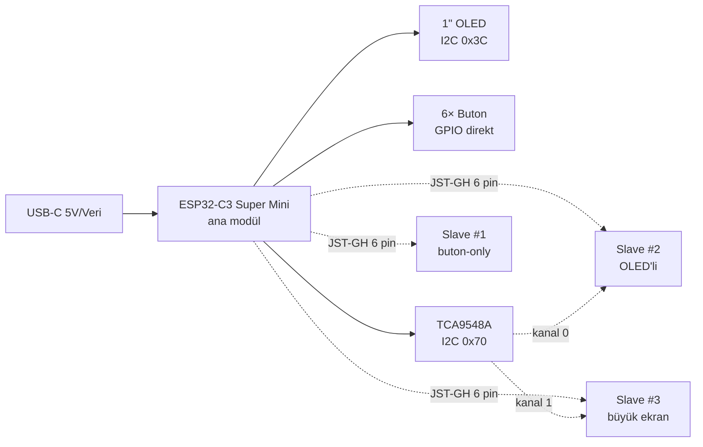
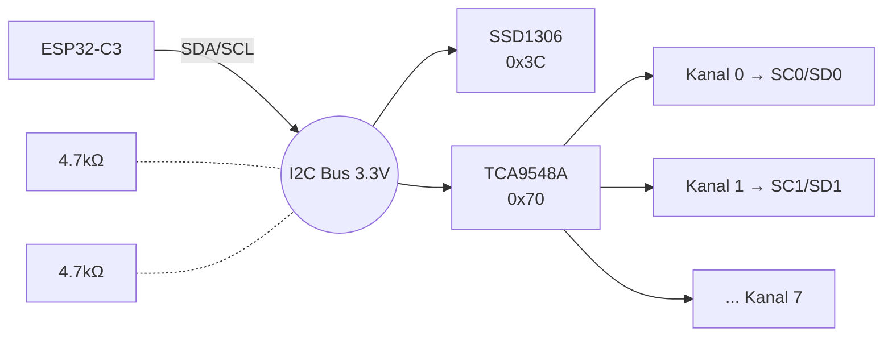
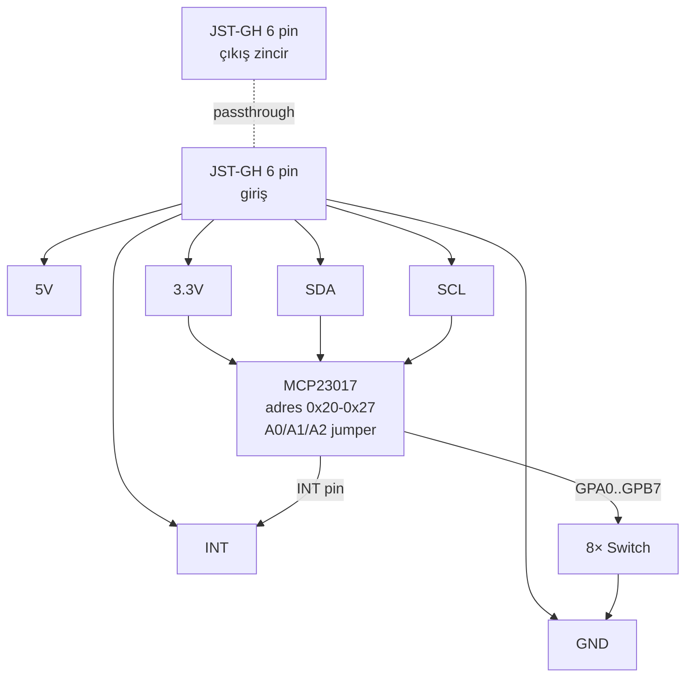
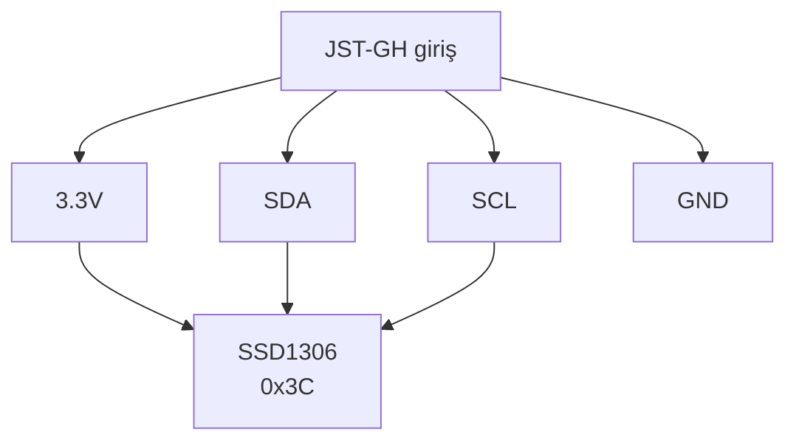
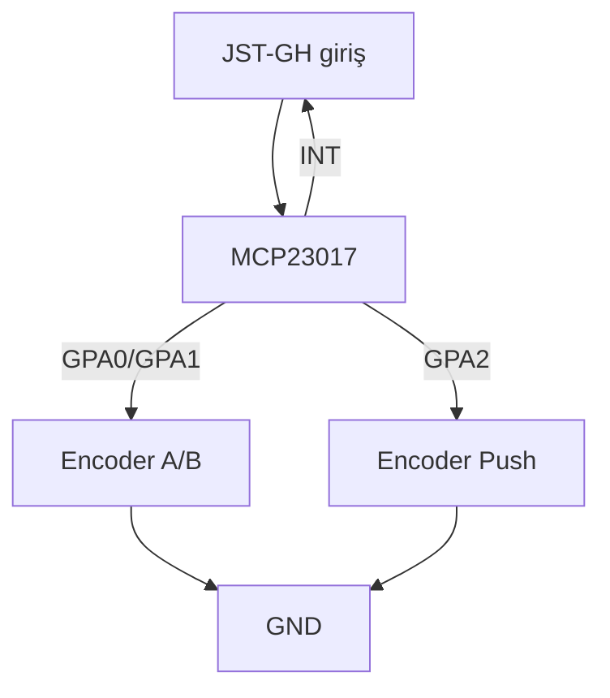
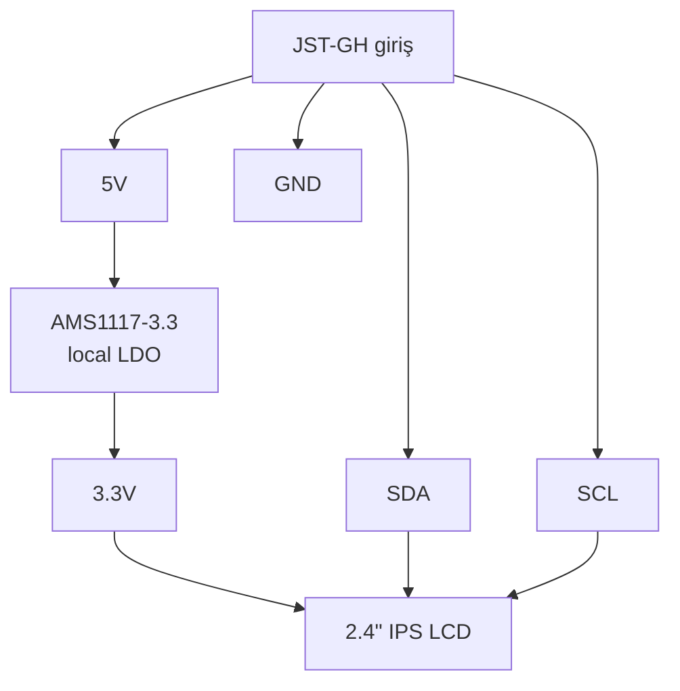

# MacroPad — Donanım Dokümantasyonu

ESP32-C3 tabanlı modüler makropad sistemi. Bir **ana modül** (master) ve N adet **slave modül** I2C üzerinden zincirleme bağlanır.

---

## 1. Sistem Mimarisi



| Bileşen | Konum | Görev |
|---|---|---|
| ESP32-C3 Super Mini | Ana modül | MCU, USB iletişim, I2C master |
| TCA9548A | Ana modül | 8 kanallı I2C mux — slave'lerin OLED/ekran çakışmalarını çözer |
| MCP23017 | Slave (buton/encoder'lı) | I2C → 16 GPIO genişletici |
| SSD1306 / IPS LCD | Ana ve OLED'li slave | 128×64 OLED (0x3C) veya SPI/I2C IPS |

---

## 2. Ana Modül

### 2.1 Bileşenler

| # | Parça | Adet | Bağlantı |
|---|---|---:|---|
| 1 | ESP32-C3 Super Mini | 1 | USB-C |
| 2 | SSD1306 0.96"/1" 128×64 OLED (I2C) | 1 | SDA/SCL → ESP |
| 3 | TCA9548A breakout | 1 | SDA/SCL → ESP |
| 4 | Mavi mekanik switch (Cherry MX uyumlu) | 6 | GPIO 0-5 |
| 5 | 4.7kΩ direnç (I2C pull-up) | 2 | SDA→3V3, SCL→3V3 (OLED breakout'ta varsa atla) |
| 6 | JST-GH 6-pin konnektör (PCB) | 1 | Slave çıkışı |

> Hot-swap soket, diyot, encoder, ek LDO/kapasitör **gerekmiyor** — ESP32-C3 Super Mini kendi LDO'su ve dekuplajıyla geliyor, TCA9548A breakout'u da kendi pasiflerini taşıyor.

### 2.2 ESP32-C3 Super Mini pinout

```
                    ┌──────────────────┐
                    │   USB-C  ▢▢▢▢   │
                    │                  │
              5V ── │ 5V          GND ─┤── GND
            3.3V ── │ 3V3                │
            BTN1 ── │ GP0          GP10 │── BTN5
            BTN2 ── │ GP1          GP9  │── BOOT butonu (KULLANMA)
                    │ GP2          GP8  │── (strapping — kullanma)
            BTN3 ── │ GP3          GP7  │── INT (slave)
            BTN4 ── │ GP4          GP6  │── SCL → OLED, TCA9548A
             SDA ── │ GP5          GP20 │── (UART RX, boş)
                    │              GP21 │── BTN6
                    └──────────────────┘
```

**Önemli notlar:**
- **GP9 BOOT butonudur** — kullanırsan boot sırasında istemeden download moduna girer. Boş bırak.
- **GP2 ve GP8 strapping pinleridir** — boot anında HIGH olmalı, kullanma.
- I2C için **GP5 (SDA) + GP6 (SCL)** kullan. Pull-up dirençler I2C hattında bir kere bulunur (genelde OLED breakout'unda zaten var).
- Butonlar GPIO ile GND arasına bağlanır, firmware'de `INPUT_PULLUP` ile içsel pull-up etkin.

### 2.3 Buton bağlantısı

Ana modüldeki **6 buton kullanıcıya açık** — uygulamadan kısayol, medya kontrolü, makro veya profil değiştirme atayabilirsin.

```
  GPIO 0, 1, 3, 4, 10, 21 ──┐
                             │
                       ┌─────┴─────┐
                       │  Switch   │   (mavi mekanik)
                       └─────┬─────┘
                             │
                            GND

  Diyot gerekmez → her buton ayrı GPIO'da, matrix yok.
  GPIO 9 BOOT butonudur, GPIO 2/8 strapping — bu pinleri kullanma.
```

### 2.4 I2C bağlantısı



OLED ve TCA9548A farklı adreslerde olduğu için **ana modül OLED'i doğrudan ana I2C hattına** bağlanır, TCA9548A'dan geçirmeye gerek yok. TCA9548A sadece slave'lerdeki çakışan adresli cihazlar (SSD1306'lar) içindir.

### 2.5 Slave çıkış konnektörü (JST-GH 6-pin)

```
 Konnektör (PCB üstü, üstten görünüş):

  ┌─────────────────────────────┐
  │  ▣   ▣   ▣   ▣   ▣   ▣    │
  │  1   2   3   4   5   6    │
  └─────────────────────────────┘

  Pin │ Sinyal │ Renk önerisi
  ────┼────────┼─────────────
   1  │  5V    │ kırmızı
   2  │ 3.3V   │ turuncu
   3  │  SDA   │ sarı
   4  │  SCL   │ yeşil
   5  │  INT   │ mavi
   6  │  GND   │ siyah
```

**5V kaynağı:** ESP32-C3 Super Mini'nin `5V` (VBUS) pini doğrudan USB-C'den gelir. Ekstra regülatör gerekmez.

---

## 3. Slave Modüller

### 3.1 Tip A — Buton-only Slave (en yaygın)

8 buton + I2C → MCP23017 üzerinden okunur.



**BOM (slave başına):**
| Parça | Adet |
|---|---:|
| MCP23017 (SOIC-28 veya DIP-28) | 1 |
| 100nF dekuplaj kapasitör | 1 |
| 10kΩ direnç (RESET pull-up) | 1 |
| 10kΩ direnç (INT pull-up — sadece zincirin son slave'inde) | 1 |
| Mavi mekanik switch | 8 |
| JST-GH 6-pin (in + out) | 2 |

**MCP23017 adresleme:** A0/A1/A2 jumper'ları ile 0x20'den 0x27'ye kadar 8 farklı adres → maks. 8 buton-slave.

### 3.2 Tip B — OLED'li Slave



**Önemli:** Bu slave'in SDA/SCL'si **ana modüldeki TCA9548A'nın bir kanalına** bağlanır (örn. SC0/SD0), ana I2C hattına değil. Aksi halde 0x3C adresi çakışır.

**BOM:** SSD1306 breakout + JST-GH × 2. MCP23017 yok.

### 3.3 Tip C — Encoder'lı Slave



Encoder'ın A ve B çıkışları MCP23017'nin iki GPIO'suna, push butonu üçüncüye gider. MCP23017'nin INT pinini kullanarak encoder dönüşlerini polling olmadan yakalayabilirsin.

**Encoder modeli:** PEC11R-4215F-S0024 (24 detent, push'lu).

### 3.4 Tip D — Büyük Ekran Slave (gelecek)

2.4" / 3.5" IPS LCD eklenirse:



**Neden local LDO?** Büyük ekran 200-500mA çekebilir. Ana modüldeki USB-C portunu yormamak için 5V hattından lokal regülasyon yap.

**Bağlantı:** Ekranın I2C/SPI hattı yine TCA9548A'nın bir kanalından geçirilmeli.

---

## 4. Güç Bütçesi

| Modül | Tipik akım |
|---|---:|
| Ana modül (ESP + OLED + 6 buton idle) | ~80 mA |
| Buton-only slave | 20-30 mA |
| OLED'li slave | 50-60 mA |
| Encoder'lı slave | 20 mA |
| 2.4" IPS slave (parlaklık 50%) | 200-300 mA |

**USB-C portu:**
- Normal PC USB portu: ~500 mA - 1 A
- USB-C şarj adaptörü: 1.5 A - 3 A

**Tavsiye:** 5'ten fazla modül veya bir büyük ekran varsa USB hub veya 5V/3A adaptörden besle.

---

## 5. Kasa & Kablolama

- Modüller arası mesafe: ~5 cm önerilir → 10 cm JST-GH kablo iyi gider.
- Mıknatıslı yan duvarlar veya pin-and-socket sistemi modülleri hizalı tutar.
- Ana modülün USB-C portu arkaya, JST-GH konnektörü yana (slave yönüne) gelmeli.

---

## 6. Toplam BOM (referans projede)

### Ana modül (sende olanlar dışındakiler)
- 1× TCA9548A breakout
- 1 set 4.7kΩ pull-up direnç (OLED breakout'ta yoksa)
- 1× JST-GH 6-pin PCB konnektör + kablo

### Slave başına (Tip A — buton-only)
- 1× MCP23017
- 8× mavi mekanik switch + keycap
- 2× JST-GH 6-pin konnektör + kablo
- 1× 100nF kapasitör, 2× 10kΩ direnç
